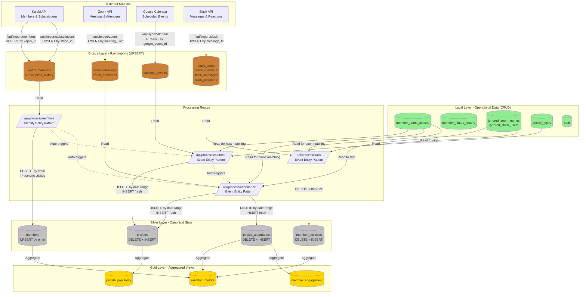
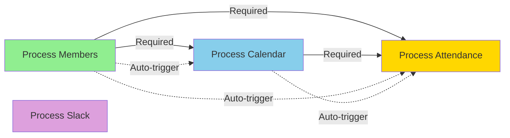

# Medallion Architecture - Quill & Cup Admin Portal

## Overview

This system uses a **Medallion Architecture** with Bronze (raw imports), Local (operational), Silver (canonical), and Gold (aggregated) layers.

## Data Flow Diagram



## Layer Responsibilities

### Bronze Layer (Raw Imports)
**Pattern:** UPSERT on natural keys for idempotency
**Purpose:** Permanent archive of all imported data
**Retention:** Forever (append-only or update-only)

- `kajabi_members` - Latest member snapshot from Kajabi
- `subscription_history` - Subscription state changes
- `zoom_meetings` - Meeting metadata
- `zoom_attendees` - Individual join/leave events
- `calendar_events` - Scheduled prickle events
- `slack_users`, `slack_channels`, `slack_messages`, `slack_reactions` - Slack data

**Key Points:**
- Data is NEVER deleted (only updated via UPSERT)
- Enables debugging and historical analysis
- Makes processing fully reprocessable

### Local Layer (Operational Data)
**Pattern:** Normal CRUD operations
**Purpose:** Data owned by this application
**Retention:** User-managed

- `member_name_aliases` - Manual name mappings for matching
- `member_hiatus_history` - Hiatus periods
- `ignored_zoom_names` - Names to skip during processing
- `ignored_slack_users` - Slack users to skip
- `prickle_types` - Event type definitions
- `staff` - Staff member records

**Key Points:**
- This is the source of truth for these tables
- NOT reprocessed (would lose user edits)
- Combined with Bronze during Silver processing

### Silver Layer (Canonical State)
**Two patterns based on entity type:**

#### Identity Entities (UPSERT Pattern)
**Example:** `members`
**Why:** Must preserve UUIDs to maintain foreign key relationships

```sql
-- Pattern: UPSERT by stable identifier (email)
INSERT INTO members (email, name, ...)
SELECT ...
FROM bronze.kajabi_members
ON CONFLICT (email) DO UPDATE SET
  name = EXCLUDED.name,
  status = EXCLUDED.status,
  updated_at = NOW();
```

**Benefits:**
- Member UUIDs never change
- Aliases, hiatus history, attendance records remain linked
- No orphaned relationships

#### Event Entities (DELETE + INSERT Pattern)
**Examples:** `prickles`, `prickle_attendance`, `member_activities`
**Why:** Must remove events that no longer exist in source data

```sql
-- Pattern: DELETE by scope, then INSERT fresh
DELETE FROM prickles
WHERE start_time >= $fromDate
  AND start_time < $toDate
  AND source = 'calendar';

INSERT INTO prickles (...)
SELECT ...
FROM bronze.calendar_events ce
JOIN local.prickle_types pt ON ...
LEFT JOIN local.member_name_aliases ma ON ...;
```

**Benefits:**
- Deleted calendar events disappear from prickles
- Members who left Zoom meetings are removed
- Always reflects current truth from Bronze + Local

### Gold Layer (Aggregated Views)
**Pattern:** Computed on-demand or via materialized views
**Purpose:** Performance optimization for dashboards

- `member_metrics` - Per-member statistics
- `member_engagement` - Engagement scores and risk levels
- `prickle_popularity` - Attendance patterns by type/time

## Processing Dependencies



**Dependency Rules:**
1. Members must be processed before Calendar (for host matching)
2. Members must be processed before Attendance (for attendee matching)
3. Calendar must be processed before Attendance (for scheduled prickle UUIDs)
4. Changes to aliases auto-trigger Calendar and Attendance reprocessing

## Reprocessability Guarantees

### Full Reprocessability
**Command:** Re-run all processing routes with same Bronze + Local data
**Result:** Identical Silver state (excluding UUIDs and timestamps)

**Example:**
```bash
# Original processing
POST /api/process/members
POST /api/process/calendar?fromDate=2026-01-01&toDate=2026-12-31
POST /api/process/attendance?fromDate=2026-01-01&toDate=2026-12-31

# Reprocessing (yields same result)
POST /api/process/members
POST /api/process/calendar?fromDate=2026-01-01&toDate=2026-12-31
POST /api/process/attendance?fromDate=2026-01-01&toDate=2026-12-31
```

### Why It Works
1. **Bronze never deleted** - Always have source data
2. **Local preserved** - User edits not lost
3. **Silver uses atomic functions** - DELETE + INSERT in single transaction
4. **Identity entities use stable keys** - Member email = permanent identifier

### What Changes on Reprocessing
- Event entities: New UUIDs (but foreign keys work via stable identifiers)
- Timestamps: `created_at`, `updated_at` reflect reprocessing time
- Computed fields: Recalculated from current Bronze + Local

### What's Preserved
- Identity entity UUIDs: Member UUIDs stay same
- Relationships: All foreign keys remain valid
- User data: Aliases, hiatus history, ignored names
- Historical accuracy: Same prickles, same attendance

## Testing Reprocessability

Every processing route must pass:
1. **Initial processing** - Creates records
2. **Reprocessing unchanged** - Same result
3. **Reprocessing with deleted source** - Removes Silver records
4. **Reprocessing with changed source** - Updates Silver records

See: `tests/api/reprocessability/`
